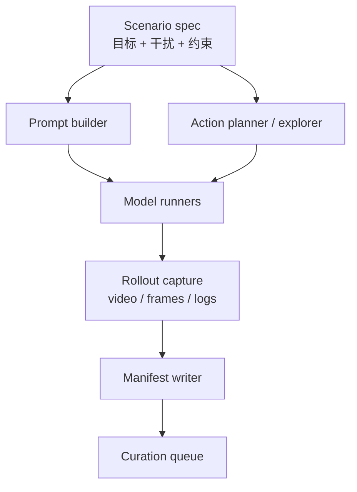

# 01 自动化数据生产

自动化数据生产的核心不是“多生成视频”，而是让每条数据都可复现、可对齐、可评价。

## 输入定义

每条任务至少有五类输入：

| 输入 | 作用 | 例子 |
| --- | --- | --- |
| `scene_seed` | 初始场景或首帧 | 槐楸店面首帧、室内机器人场景、仓库货架 |
| `target_state` | 要保持或验证的世界状态 | 招牌文字、物体位置、门窗关系、可抓取物体状态 |
| `action_schedule` | 代理要执行的动作 | 2s 一步的 yaw、forward、back、left、right、interact |
| `stressors` | 故意加入的难点 | 长 offscreen、相似干扰物、多次回看、遮挡、尺度变化 |
| `success_contract` | 什么算任务成功 | 回到同一店面、拿起正确物体、避开错误目标 |

## 数据生产链路



## 自动化 Collector Agent

Collector agent 只负责稳定生产，不负责最终判断质量。

它的职责：

- 根据任务模板生成 prompt、action list、初始图或空间草图。
- 调用不同系统生成 rollout：Genie3、Matrix-Game、DreamDojo、Marble、Seed-Dance variants。
- 保证同一个 protocol 下 prompt 和 action 可对齐。
- 保存视频、抽帧、运行日志、模型版本、随机种子、输入文件哈希。
- 失败时记录失败类型，而不是静默丢弃。

## 任务生成方式

### 1. 模板生成

适合第一阶段。人为定义任务族，程序化采样参数。

示例：

```text
任务族：长时序记忆一致性
目标：某个可读招牌 / 物体 / 房间布局
动作：看见目标 -> 转开 -> 经过干扰物 -> 返回目标
压力：offscreen gap、revisit 次数、confuser 相似度
```

### 2. MCTS / search 生成

适合自动找难样本。搜索目标不是“随机探索”，而是最大化评价难度。

可优化目标：

- 目标可见次数足够多。
- offscreen 时间足够长。
- 回看次数多。
- 中途出现相似干扰物。
- 动作轨迹不太机械，像真实 agent 探索。

### 3. Few-shot guided exploration

适合把人类经验注入 agent。

人先标注几个“好探索”和“坏探索”：

- 好探索：先建立目标记忆，再离开，再从不同角度回看。
- 坏探索：原地乱转、没有目标、没有回看、动作不可解释。

agent 再模仿这些探索偏好生成新 action schedule。

## 数据目录建议

```text
runs/<protocol_id>/
  spec.json
  shared_prompt.txt
  action_schedule.csv
  model_a/
    video.mp4
    frames/
    metadata.json
    quality_gate.json
  model_b/
    video.mp4
    frames/
    metadata.json
    quality_gate.json
  comparison/
    contact_sheet.jpg
    action_following.csv
    eval_summary.json
```

## 必须记录的元数据

- `protocol_id`
- `task_family`
- `target_description`
- `scene_seed_path`
- `prompt_path`
- `action_schedule_path`
- `model_name`
- `model_version`
- `runner_version`
- `seed`
- `generation_time`
- `video_path`
- `duration_s`
- `fps`
- `resolution`
- `num_frames`
- `status`
- `failure_reason`

## 数据生产的第一道红线

如果没有 action-following 检查，后面的 memory evaluation 会被污染。

所以每条 rollout 进入评价前必须先过三道门：

1. `valid_video`: 视频能打开，长度/分辨率/帧数正常。
2. `initial_state_valid`: 起始目标确实存在。
3. `action_following_valid`: 至少大体按动作发生了对应变化。

这一步不要求模型记忆正确，只检查“这个实验是否成立”。
