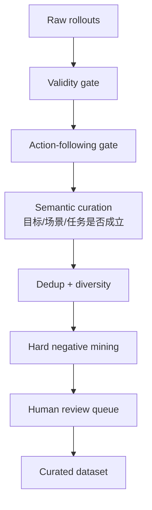

# 02 Curation

Curation 的目标不是把坏样本删掉，而是把样本分成不同用途：

- 可直接进入 evaluation 的样本；
- 可作为 hard negative 的样本；
- 需要人工复核的不确定样本；
- 生成或录制失败的无效样本；
- 可用于训练偏好的 preference pair。

## Curation 流程



## Curation Agent 职责

### 1. 质量门槛

检查视频是不是基本有效：

- 是否能打开；
- 时长是否符合协议；
- 是否黑屏、花屏、纹理塌缩；
- 初始目标是否存在；
- 抽帧是否成功；
- metadata 是否完整。

### 2. Action-following 门槛

先检查动作是否被执行：

- `HOLD` 是否相对稳定；
- `YAW_R/YAW_L` 是否有视角变化；
- `FWD/BACK/LEFT/RIGHT` 是否有空间位移感；
- `INTERACT` 是否产生预期对象状态变化。

这一步只判断控制是否成立，不判断最终任务是否成功。

### 3. 去重

要查：

- 视频文件哈希；
- 关键帧 perceptual hash；
- prompt/action 是否重复；
- 不同 protocol 是否实际生成同一条视频。

如果不同任务生成了完全相同的视频，这是重要信号：

```text
prompt/action 条件没有真正影响 rollout
```

这类样本应标成 `condition_insensitive_failure`。

### 4. 覆盖度

按任务因子统计覆盖：

- 场景类型：室内、街道、仓库、厨房、机器人桌面；
- 目标类型：文字、物体、门窗、可交互物、动态 agent；
- 动作类型：转头、移动、返回、抓取、推拉、避障；
- 难度：短 offscreen、长 offscreen、相似干扰、遮挡、多次回看；
- 模型来源：Genie3、Matrix-Game、DreamDojo、Marble、Seed-Dance variants。

### 5. Hard negative 挖掘

hard negative 是最有训练价值的样本。

典型类型：

| 类型 | 描述 |
| --- | --- |
| `visual_plausible_wrong_identity` | 看起来合理，但不是同一物体 |
| `text_drift` | 招牌/文字从正确变成乱码或相似字 |
| `layout_swap` | 门窗、物体相对位置改变 |
| `scale_jump` | 前进/后退后尺度变化不符合物理 |
| `action_mismatch` | 指令要求转向或移动，视频没有对应变化 |
| `condition_insensitive` | 不同 prompt/action 生成同一条或近似同一条视频 |
| `late_memory_collapse` | 前半段正确，后半段长时序崩溃 |

## Curation 输出

每条样本建议标成一个 curation 状态：

| 状态 | 用途 |
| --- | --- |
| `ready_for_eval` | 进入正式 evaluation |
| `hard_negative` | 用于 few-shot、reward、DPO/RLAIF |
| `needs_human_review` | 进入人工复核 |
| `invalid_video` | 不进入评价 |
| `control_failed` | 动作跟随失败，不做 memory 评分 |
| `duplicate_or_condition_insensitive` | 作为条件不敏感失败证据 |

## 人在 curation 里的作用

人不需要标所有数据。人要做的是定义边界：

- 这个错误算不算失败；
- 这个样本是不是 hard negative；
- 这个探索路径像不像一个合理 agent；
- 这个不确定样本应该进入哪类标签。

少量人类 few-shot 的作用是让 curator agent 学会筛选偏好。

## Curation 和训练的关系

Curation 结果可以直接变成训练资产：

| Curation 发现 | 训练用途 |
| --- | --- |
| 好 rollout vs 坏 rollout | preference pair |
| hard negative | reward model 负例 |
| action mismatch | control alignment 数据 |
| late memory collapse | 长时序稳定性训练数据 |
| uncertain sample | active learning 回流人工 |
