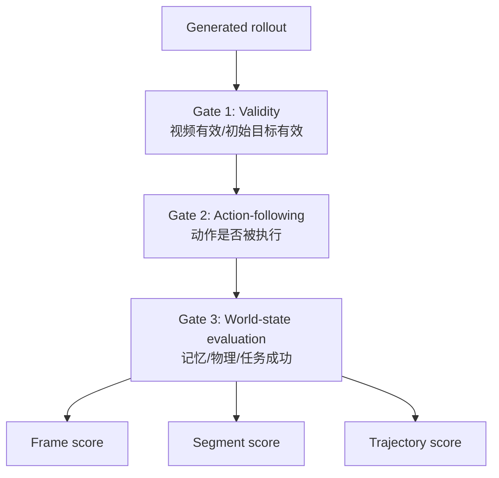

# 03 Evaluation

Evaluation 的核心顺序：

```text
先判断实验是否成立
再判断动作是否执行
最后判断世界状态是否正确
```

如果 action 都没执行，就不能直接说模型“记忆失败”。那叫控制失败或采集失败。

## 三层 Gate



## Gate 1: Validity

检查：

- 视频能否打开；
- 长度是否满足协议；
- 抽帧是否成功；
- 初始目标是否存在；
- 是否出现黑屏、花屏、贴图崩溃；
- prompt、action、metadata 是否齐全。

输出：

```json
{
  "valid_video": true,
  "initial_state_valid": true,
  "failure_reason": ""
}
```

## Gate 2: Action-following

先做轻量自动检查，再做关键步骤人工/VLM 复核。

### 轻量自动检查

用 2s 抽帧看相邻帧变化：

- `HOLD`: 变化应小；
- `YAW`: 变化应明显；
- `FWD/BACK/LEFT/RIGHT`: 应出现空间位移感；
- `INTERACT`: 物体状态应改变。

输出指标：

- `motion_match_rate`
- `hold_low_motion_rate`
- `move_high_motion_rate`
- `action_mismatch_steps`

### 人工/VLM 复核

自动 motion proxy 只能判断“动没动”，不能完全判断“方向对不对”。

需要复核：

- `YAW_R` 是否真向右；
- `YAW_L` 是否真向左；
- `FWD` 是否前进而不是缩放错觉；
- `BACK` 是否后退而不是目标漂移；
- `INTERACT` 是否作用在正确物体上。

## Gate 3: World-state Evaluation

世界状态评价分三层。

### 1. Frame-level

单帧问题：

- 目标是否可见；
- 文字/物体身份是否正确；
- 目标与周围结构是否对齐；
- 是否出现 confuser。

### 2. Segment-level

片段问题：

- 离开目标后是否能回看；
- 回看的是否是同一个目标；
- 中间经过干扰物时是否混淆；
- 目标从不可见到可见的转变是否合理。

### 3. Trajectory-level

全轨迹问题：

- 多次回看是否保持同一世界；
- 长 offscreen 后是否仍能恢复目标；
- 动作后果是否物理合理；
- 最终任务是否成功。

## 核心指标

| 指标 | 含义 |
| --- | --- |
| `action_following_score` | 是否执行动作协议 |
| `target_identity_score` | 是否保持同一目标 |
| `text_consistency_score` | 文字是否稳定 |
| `layout_consistency_score` | 门窗/物体/空间结构是否稳定 |
| `physical_plausibility_score` | 动作后果、尺度、碰撞、运动是否合理 |
| `revisit_valid_score` | 回看是否真的回到目标 |
| `memory_consistency_score` | 长时序世界状态是否守恒 |
| `task_success` | 任务是否完成 |
| `uncertainty` | evaluator 是否需要人工复核 |

## 对不同系统的评价方式

| 系统 | 重点 |
| --- | --- |
| Genie3 / Matrix-Game | action-following、长时序记忆、探索一致性 |
| DreamDojo | 任务执行、交互后果、机器人/agent 行为 |
| Marble | 3D 几何、collision mesh、空间可探索性 |
| Seed-Dance video base | 视频 prior、物理常识、后训练 preference 数据 |

## Evaluation 和 Curation 的关系

Evaluation 不只是打分，它也会反向驱动 curation：

```text
低分但有代表性 -> hard negative
高不确定 -> human review
重复失败 -> failure taxonomy
高分稳定 -> positive preference
相同任务高低对比 -> pairwise training data
```

## 最关键的面试表达

> 我会先把 evaluation 拆成 gate。第一道 gate 验证视频有效，第二道 gate 验证 action-following，第三道才评价 memory consistency 和 physical plausibility。这样可以避免把控制失败误判成世界模型失败，也可以把失败样本转成可用的训练信号。
