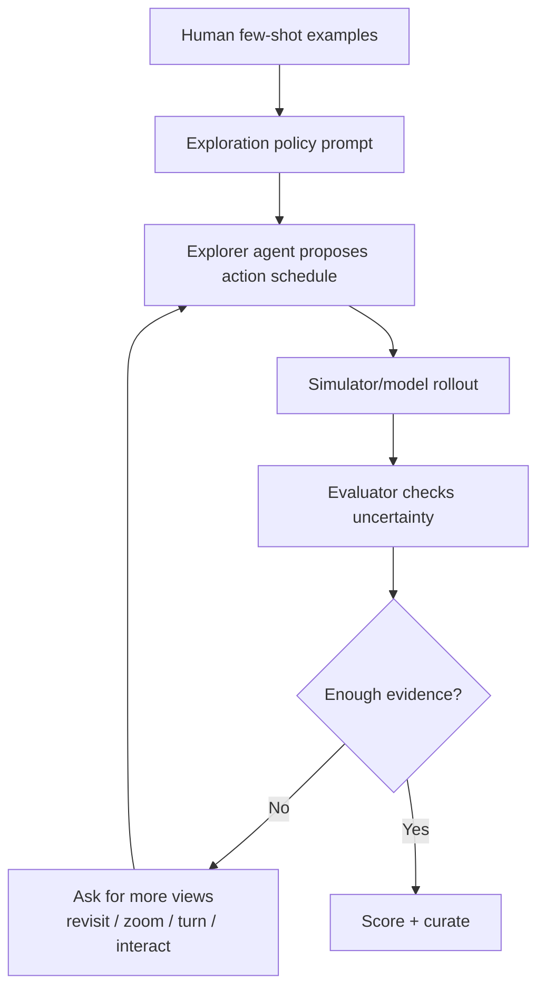

# 04 Few-shot Agent Exploration

这里是整个方案最重要的部分：如何让 agent 根据人给的 few-shot 做“类似人的探索”。

## 为什么不能纯随机探索

随机探索容易产生大量低价值数据：

- 原地转圈；
- 没有明确目标；
- 没有回看；
- 没有制造干扰；
- 没有验证世界状态；
- 动作路径不像真实 embodied agent。

真正有价值的探索像人一样：

```text
先观察目标
记住关键身份线索
故意离开目标
经过干扰或遮挡
从不同角度回看
验证是不是同一个世界状态
```

## 人类 few-shot 提供什么

人不只是给标签，还要给探索偏好。

### Few-shot 类型

| 类型 | 作用 |
| --- | --- |
| 好探索正例 | 让 agent 学什么样的路径有信息量 |
| 坏探索负例 | 避免原地打转、无目标移动 |
| hard negative | 教 evaluator 区分“像”与“是” |
| borderline | 教 agent 什么时候需要继续探索 |
| failure explanation | 教 agent 为什么错 |

## Agent 如何使用 few-shot



## 类似人的探索策略

### 1. 建立目标记忆

开始几秒不要急着走，要让 agent 观察目标的 identity anchors：

- 文字；
- 颜色；
- 形状；
- 相邻物体；
- 门窗/桌面/墙面布局；
- 距离和朝向。

### 2. 制造离屏

必须让目标离开视野，否则测不到记忆。

动作：

- turn away；
- back away；
- move laterally；
- enter another room；
- pass behind occluder。

### 3. 引入干扰物

要让任务难起来：

- 相似店面；
- 相似杯子/盒子/工具；
- 同类动物/机器人目标；
- 相似房间布局；
- 动态遮挡。

### 4. 多次回看

人判断“是不是同一个东西”时会反复看。

所以 agent 应该主动：

- 第一次短回看确认；
- 中段从不同角度回看；
- 最终长 offscreen 后回看；
- 如果不确定，再换角度回看。

### 5. 主动寻找反证

类似人的 evaluator 不只找支持证据，也找反证：

- 字是不是变了；
- 门窗是不是换位置了；
- 同一个物体的左右关系是否互换；
- 后退后物体尺度是否不合理；
- 回来的路径是否不可能。

## Explorer Agent 的决策循环

```text
observe current state
extract identity anchors
choose next action to increase evidence
execute action
compare current state with memory
if uncertain, request another view
if contradiction, mark failure type
if enough evidence, stop and score
```

## Agent Prompt 模板

```text
你是一个 world-model exploration agent。
你的目标不是随便移动，而是设计能验证世界状态一致性的动作序列。

人类 few-shot 告诉你：
1. 好探索会先观察目标，再离开，再经过干扰，最后回看。
2. 坏探索包括原地乱转、没有目标、没有回看、动作无法解释。
3. 如果最终画面看起来像目标但门窗/文字/空间关系不一致，应判为失败。

请输出：
- action schedule，每步 2 秒；
- 每一步的目的；
- 预期目标是否可见；
- 该步会增加什么评价证据；
- 如果模型在这一步失败，可能是什么 failure type。
```

## Evaluation Agent 的 few-shot 使用方式

Evaluator 不直接相信模型输出，要像人一样比对证据：

| 问题 | 人类 few-shot 教 agent 看什么 |
| --- | --- |
| 是不是同一个目标 | identity anchors 是否稳定 |
| 是不是同一个空间 | 相邻物体、布局、拓扑是否一致 |
| 动作是否合理 | 视角、距离、尺度变化是否符合动作 |
| 是否混淆 | 是否把相似目标当成原目标 |
| 是否需要继续探索 | 证据不足时提出下一步动作 |

## Exploration 评分

除了评视频，还要评 action schedule 本身是不是好探索。

| 指标 | 含义 |
| --- | --- |
| `target_observation_score` | 是否充分观察目标 |
| `offscreen_stress_score` | 是否制造足够离屏压力 |
| `confuser_score` | 是否引入有效干扰 |
| `revisit_score` | 是否多次回看 |
| `efficiency_score` | 是否避免无意义动作 |
| `human_like_exploration_score` | 是否像一个有目标的人或 embodied agent |

## 最小落地方式

第一版不用训练复杂 RL policy。

可先做：

1. 人写 5 条好 action schedule，5 条坏 action schedule。
2. 人给每条写一句解释：为什么好/坏。
3. 用这些 few-shot 让 LLM agent 生成 30 条新 schedule。
4. 用规则和人工抽检过滤：
   - 是否有初始观察；
   - 是否有离屏；
   - 是否有回看；
   - 是否有干扰；
   - 是否动作过度重复。
5. 把通过的 schedule 送入自动采集。

这就是“few-shot guided human-like exploration”的第一阶段。
