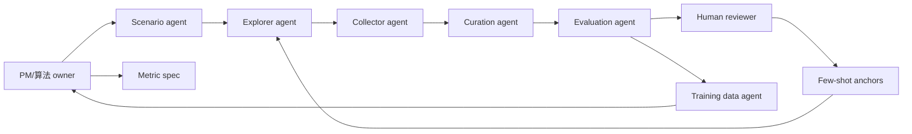

# 05 协作与里程碑

这个项目需要多类 agent 和多人协作。PM/算法负责把模糊目标变成可执行协议、可量化指标和闭环迭代。

## 角色分工

| 角色 | 职责 | 产物 |
| --- | --- | --- |
| PM/算法 owner | 定义任务、指标、闭环优先级 | data plan、metric spec、验收标准 |
| Scenario agent | 生成任务族和难度参数 | protocol specs |
| Explorer agent | 根据 few-shot 生成类人探索路径 | action schedules |
| Collector agent | 调用模型/引擎采集 rollout | videos、frames、metadata |
| Curation agent | 质量门槛、去重、hard negative | curation manifest |
| Evaluation agent | 帧/片段/轨迹打分 | eval table、failure taxonomy |
| Human reviewer | 提供 few-shot 和复核不确定样本 | labels、review notes |
| Training data agent | 转成 preference/reward/filtering 数据 | training dataset |

## 协作图

## 第一阶段里程碑

### Week 1: 定义闭环

产物：

- 3 个任务族；
- 每个任务族 5-10 条 seed protocol；
- 20-50 个 human few-shot anchors；
- label schema；
- evaluation gates。

验收：

- 人能解释每个任务为什么测 world model；
- agent 能根据 few-shot 生成合理 action schedule。

### Week 2: 自动化采集

产物：

- Collector agent 跑通 1-2 个模型或引擎；
- 每条数据保存 prompt/action/video/metadata；
- 自动抽帧和 contact sheet；
- 失败样本进入日志。

验收：

- 30-100 条 rollout；
- 每条可以追溯到 protocol；
- 初始质量门槛自动跑通。

### Week 3: Curation + Evaluation

产物：

- action-following audit；
- curation manifest；
- hard negative 队列；
- frame/segment/trajectory eval table；
- VLM judge prompt。

验收：

- 能区分 valid video、control failed、memory failed；
- 能输出 10-20 个高价值 hard negative；
- 人工抽检和 agent 判断基本一致。

### Week 4: Training feedback

产物：

- preference pairs；
- reward model 数据；
- filtering list；
- 下一轮主动采样策略。

验收：

- 训练团队能直接使用这些数据；
- 下一轮数据生产不是随机扩量，而是针对失败模式补样本。

## 第一阶段优先做什么

优先级：

1. Human few-shot anchors。
2. 自动采集 manifest 和 runner。
3. action-following gate。
4. frame/segment/trajectory evaluation。
5. hard negative curation。

不要第一阶段就做：

- 复杂在线 RL；
- 完全自动无人工审核；
- 只追求视频数量；
- 没有 action 验证就做 memory conclusion。

## 会议里怎么讲

可以按这个顺序讲：

1. 我们先定义模型应该具备什么世界能力，而不是先抓一堆视频。
2. 人类 few-shot 把隐性的物理空间判断变成显式 label。
3. Agent 根据 few-shot 学会生成类似人的探索路径。
4. Collector 自动生产多模型、多协议 rollout。
5. Curation 先判断视频有效和 action-following，再挖 hard negative。
6. Evaluation 按帧、片段、轨迹打分。
7. 最后把结果回流成 preference data、reward data 和下一轮主动采样。

## 风险与对策

| 风险 | 对策 |
| --- | --- |
| action list 生硬 | 用 few-shot 标注“好探索/坏探索”，让 explorer agent 生成更自然路径 |
| 模型不听 action | 先做 action-following gate，不合格不进入 memory scoring |
| 自动 judge 幻觉 | 用 human few-shot 校准，并把高不确定样本回流人工 |
| 数据量大但价值低 | curation 按 hard negative 和 coverage 筛选 |
| 多系统不可比 | 固定 shared prompt、action schedule、metadata schema |
| 只评画质 | 指标强制包含 identity、layout、physics、action consequence |
