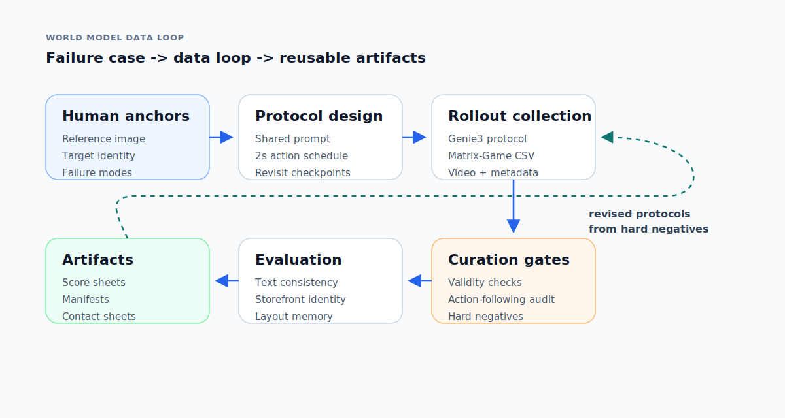
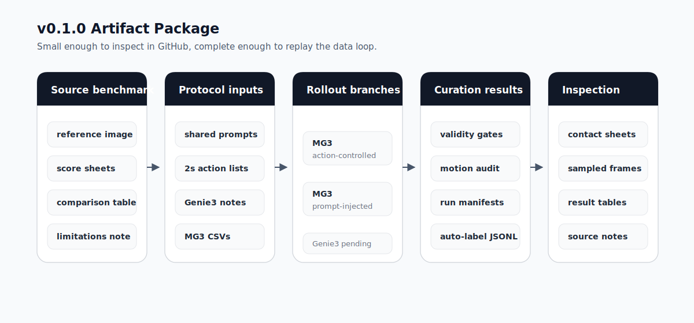
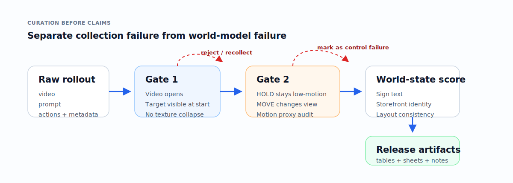

# World Model Data Loop

**From one concrete world-model failure case to a reproducible data-production, curation, and evaluation loop.**

## Motivation

Interactive world models can generate coherent-looking video while failing to preserve persistent state. In this experiment, the target is a Chinese storefront sign reading `槐楸`. After the model moves away, loses sight of the sign, and revisits the area, the core question is whether it preserves the same sign, storefront identity, and local spatial layout.

This repository packages the v0.1.0 artifacts around that question. It is not a leaderboard; it is a compact data loop for making the experiment inspectable, replayable, and extensible.

## Data Loop

The key addition in v0.1.0 is the layer before final evaluation: shared prompts, controlled action schedules, rollout manifests, and action-following checks.

## v0.1.0 Artifact Package

| Layer | Included |
| --- | --- |
| Original benchmark | Reference image, score sheets, Genie3 notes, Matrix-Game 3.0 action-controlled evaluation, comparison tables |
| Data production | Ten 72-second revisit protocols at 2-second resolution |
| Control inputs | Shared prompts, human-readable action lists, Genie3 operation notes, Matrix-Game 3.0 action CSVs |
| Curation | Video validity records, action-following audit, prompt-injected control branch |
| Evaluation artifacts | Contact sheets, sampled frames, manifests, result tables |

Raw videos are intentionally excluded from this lightweight repo. The committed materials are designed for fast inspection and reproducibility.

## Curation and Evaluation Gates

The release separates control failures from world-model failures. A rollout must first pass video validity and action-following checks before it is used for memory, identity, and layout scoring.

## Current Status

- Matrix-Game 3.0 action-controlled rollouts have been generated for all 10 protocols and passed the initial quality gate.
- The prompt-injected Matrix-Game 3.0 branch is included as a weaker control condition.
- Mean motion match is `0.872` for the action-controlled branch and `0.540` for the prompt-injected branch.
- The matched 10-protocol Genie3 set is not complete yet, so this release should not be read as a strict Genie3 vs Matrix-Game 3.0 ranking.

## Where to Look

- [assets/diagrams](assets/diagrams/): SVG diagrams used to organize the data loop.
- [examples/huaiqiu_memory_consistency](examples/huaiqiu_memory_consistency/): public Huaiqiu artifact package.
- [examples/huaiqiu_memory_consistency/manifests/action_following_summary.csv](examples/huaiqiu_memory_consistency/manifests/action_following_summary.csv): action-following audit summary.
- [examples/huaiqiu_memory_consistency/contact_sheets](examples/huaiqiu_memory_consistency/contact_sheets/): sampled-frame sheets for quick visual inspection.
- [examples/huaiqiu_memory_consistency/source_notes/original_memory_benchmark_README.md](examples/huaiqiu_memory_consistency/source_notes/original_memory_benchmark_README.md): snapshot of the original benchmark README.

## Draft Notes

- [01_自动化数据生产.md](01_自动化数据生产.md): automated data production.
- [02_curation.md](02_curation.md): validity checks, action-following checks, and hard-negative curation.
- [03_evaluation.md](03_evaluation.md): action-following, memory consistency, and physical plausibility evaluation.
- [04_fewshot_agent_exploration.md](04_fewshot_agent_exploration.md): using few-shot examples to constrain exploration paths.
- [05_协作与里程碑.md](05_协作与里程碑.md): collaboration and next milestones.
- [schemas.md](schemas.md): manifest, label, and evaluation request schemas.

## External Link

- Genie3 Huaiqiu project: [Project Genie](https://labs.google/fx/projectgenie/zh/tools/projectgenie/9cc50806-81da-4931-969e-07fe8069113a)
