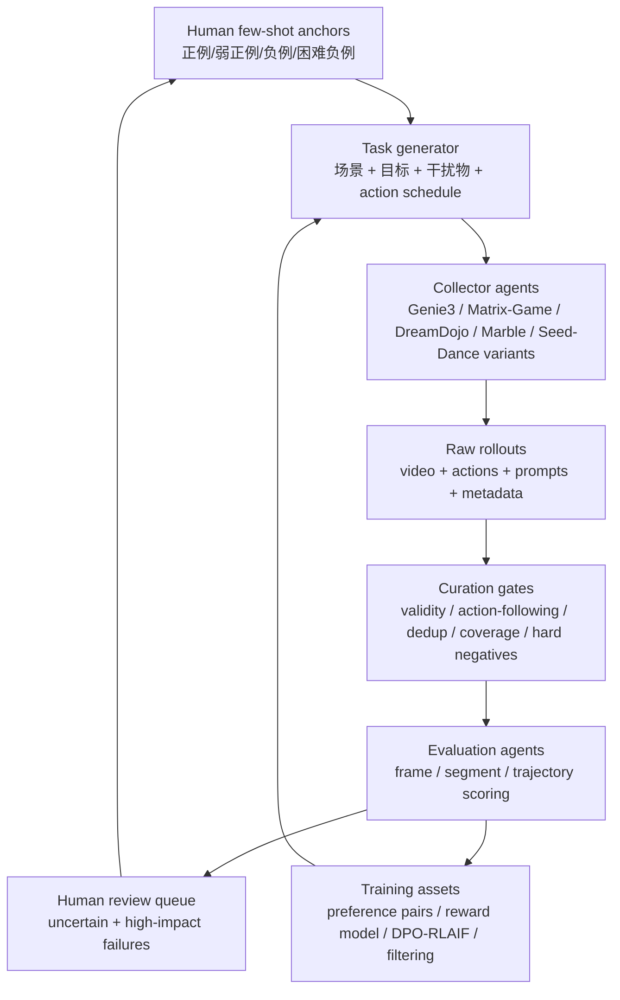

# 自动化数据闭环方案

## Overview

这个仓库记录的是我把一次 world model 评估问题往前补成数据闭环的过程。

原始问题很具体：模型看到一块写着 `槐楸` 的中文招牌，移动、转头、离屏，再回来以后，它还记不记得这是同一块招牌？这本来是一个纯 evaluation 问题。但如果要把它变成可持续迭代的数据工作，只做最后打分还不够，前面还要补两件事：怎么稳定地产生这类长时序样本，以及怎么在进入正式评测前先筛掉无效视频、控制失败和低价值路径。

所以我的版本是在原 benchmark 前面加了 data production 和 curation。人先给少量 few-shot，定义什么叫同一物体、同一空间、动作后果正确；agent 再按这些例子生成探索路径，批量采集长时序 rollout；curation 先检查视频有效性和 action-following，再挖 hard negative；最后 evaluation 才按帧、片段、轨迹评分，并把结果整理成 preference pairs、reward data 和下一轮主动采样策略。

## Motivation

现在很多 world model 生成的视频看起来是连贯的，但它们不一定真的保住了世界状态。文字会漂，物体身份会换，门窗和招牌的相对位置会变，回到的也可能只是“像原来那家店”的另一个场景。

这类问题靠普通视频质量指标很难看出来。FVD、LPIPS 可以告诉我们画面是否像视频、是否有感知质量，但不一定能回答“这是不是同一个物体”“这个动作之后的空间关系是否合理”。因此需要把人类一眼能看出的空间/物理错误，拆成可标注、可筛选、可复验的样本和指标。

## Online / Source Links

- 原始 `槐楸` 记忆一致性实验入口保存在 [examples/huaiqiu_memory_consistency/source_notes/original_memory_benchmark_README.md](examples/huaiqiu_memory_consistency/source_notes/original_memory_benchmark_README.md)。
- Genie3 槐楸项目链接：[Project Genie](https://labs.google/fx/projectgenie/zh/tools/projectgenie/9cc50806-81da-4931-969e-07fe8069113a)。
- 当前仓库里的公开示例：[examples/huaiqiu_memory_consistency](examples/huaiqiu_memory_consistency/)。

## 一句话版本

具体闭环长这样：

```text
人类 few-shot 定义“什么算对/错”
        ↓
agent 自动生成场景、prompt、action、探索任务
        ↓
多模型/多引擎批量 rollout 生成视频与状态数据
        ↓
curation agent 做质量门槛、动作跟随、去重、hard negative 挖掘
        ↓
evaluation agent 按帧/片段/轨迹打分
        ↓
产出 preference pair、reward data、failure taxonomy
        ↓
回流到训练、数据过滤、下一轮主动采样
```

## 核心图



## 文件导览

- [01_自动化数据生产.md](01_自动化数据生产.md)
  讲怎么自动化生成任务、prompt、action、rollout、元数据。

- [02_curation.md](02_curation.md)
  讲数据进入训练或评测前怎么筛选、分层、去重、挖 hard negative。

- [03_evaluation.md](03_evaluation.md)
  讲 action-following、memory consistency、physical plausibility 的评价层级。

- [04_fewshot_agent_exploration.md](04_fewshot_agent_exploration.md)
  重点讲如何让 agent 根据人给的 few-shot 学会“类似人的探索”。

- [05_协作与里程碑.md](05_协作与里程碑.md)
  讲 PM、算法、数据、平台、标注、评测 agent 怎么协作，以及第一阶段怎么落地。

- [schemas.md](schemas.md)
  给出 manifest、label、evaluation request 的字段模板。

- [examples/huaiqiu_memory_consistency](examples/huaiqiu_memory_consistency/)
  放入 `槐楸` 实验的公开材料：原始 reference、评估表、prompt、action list、Matrix-Game CSV、Genie3 操作协议、manifest、action-following 评估结果和 contact sheet。原始 mp4 体积较大，没有放进这个轻量仓库。

## 最小闭环

第一阶段不要追求全自动完美系统，而是做一个小而硬的闭环：

| 阶段 | 最小产物 | 成功标准 |
| --- | --- | --- |
| Human few-shot | 20-50 个正/负例标注 | evaluator 能复述人类判断标准 |
| Data production | 30-100 条可复现 rollout | 每条都有 prompt/action/video/metadata |
| Curation | 有质量门槛和 hard negative 队列 | 坏样本不是被丢弃，而是进入 failure taxonomy |
| Evaluation | 帧/片段/轨迹三级评分 | 能区分“好看”和“物理正确” |
| Training feedback | preference pairs / filtering list | 能告诉训练该奖励什么、压低什么 |

## 面试表述

面试时可以直接从开头的 Overview 切入，再按“few-shot 定义标准、agent 生产数据、curation 过滤和挖负例、evaluation 产出训练信号”这个顺序展开。
