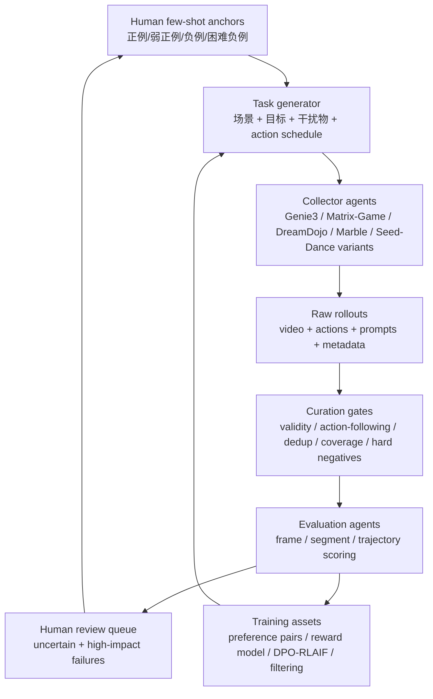

# 自动化数据闭环方案

## Overview

我负责的不是单纯数据采集，而是把 world model 的失败模式产品化成可生产、可筛选、可评估的数据闭环。第一步由人给 few-shot，定义什么叫同一物体、同一空间、动作后果正确。然后让 agent 根据这些 few-shot 生成探索策略，自动采集长时序 rollout。curation 阶段先检查视频有效性和 action-following，再挖 hard negative。evaluation 阶段按帧、片段、轨迹打分，最后把结果转成 preference pairs、reward data 和下一轮主动采样策略。

## 一句话版本

我们要做的是一个面向 world model / video foundation model 的数据生产与评估闭环：

```text
人类 few-shot 定义“什么算对/错”
        ↓
agent 自动生成场景、prompt、action、探索任务
        ↓
多模型/多引擎批量 rollout 生成视频与状态数据
        ↓
curation agent 做质量门槛、动作跟随、去重、hard negative 挖掘
        ↓
evaluation agent 按帧/片段/轨迹打分
        ↓
产出 preference pair、reward data、failure taxonomy
        ↓
回流到训练、数据过滤、下一轮主动采样
```

## 核心图



## 文件导览

- [01_自动化数据生产.md](01_自动化数据生产.md)
  讲怎么自动化生成任务、prompt、action、rollout、元数据。

- [02_curation.md](02_curation.md)
  讲数据进入训练或评测前怎么筛选、分层、去重、挖 hard negative。

- [03_evaluation.md](03_evaluation.md)
  讲 action-following、memory consistency、physical plausibility 的评价层级。

- [04_fewshot_agent_exploration.md](04_fewshot_agent_exploration.md)
  重点讲如何让 agent 根据人给的 few-shot 学会“类似人的探索”。

- [05_协作与里程碑.md](05_协作与里程碑.md)
  讲 PM、算法、数据、平台、标注、评测 agent 怎么协作，以及第一阶段怎么落地。

- [schemas.md](schemas.md)
  给出 manifest、label、evaluation request 的字段模板。

## 最小闭环

第一阶段不要追求全自动完美系统，而是做一个小而硬的闭环：

| 阶段 | 最小产物 | 成功标准 |
| --- | --- | --- |
| Human few-shot | 20-50 个正/负例标注 | evaluator 能复述人类判断标准 |
| Data production | 30-100 条可复现 rollout | 每条都有 prompt/action/video/metadata |
| Curation | 有质量门槛和 hard negative 队列 | 坏样本不是被丢弃，而是进入 failure taxonomy |
| Evaluation | 帧/片段/轨迹三级评分 | 能区分“好看”和“物理正确” |
| Training feedback | preference pairs / filtering list | 能告诉训练该奖励什么、压低什么 |

## 面试表述

面试时可以直接从开头的 Overview 切入，再按“few-shot 定义标准、agent 生产数据、curation 过滤和挖负例、evaluation 产出训练信号”这个顺序展开。
